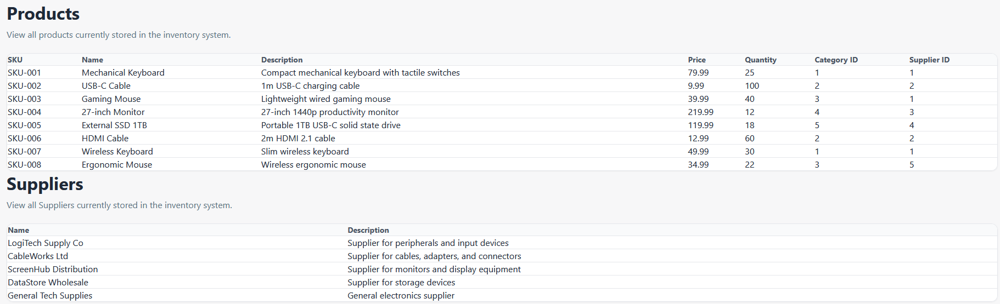

# Inventory Manager

A full-stack inventory management application built with **ASP.NET Core**, **PostgreSQL**, **React**, and **TypeScript**.

The project is being developed as a practical exercise in full-stack architecture, REST API design, relational persistence, containerised development, and typed frontend integration.

> **Project status:** Active development. The backend CRUD API and PostgreSQL persistence are implemented. The React frontend can retrieve and display inventory data, while the user interface and wider frontend workflows are still being developed.

## Screenshots

### Products and suppliers




## Current functionality

- RESTful CRUD operations for the core inventory entities
- PostgreSQL persistence
- Entity Framework Core migrations and relational mapping
- Docker Compose configuration for the development database
- Layered backend structure separating API, domain, application, and infrastructure concerns
- React and TypeScript frontend integration
- Product and supplier data retrieval and display

## Core domain entities

| Entity | Purpose |
|---|---|
| **Product** | Stores product details such as SKU, name, description, price, quantity, category, and supplier |
| **Category** | Groups products into meaningful inventory categories |
| **Supplier** | Represents the organisations supplying inventory items |
| **Warehouse** | Represents physical storage locations for inventory |

## Technology stack

### Backend

- C#
- ASP.NET Core Web API
- Entity Framework Core
- PostgreSQL
- RESTful API design

### Frontend

- React
- TypeScript
- HTML and CSS

### Development tools

- Docker and Docker Compose
- Git and GitHub
- .NET CLI
- npm

## Architecture

The backend follows a layered structure:

```text
src/
├── InventoryManager.Api/
│   ├── Controllers/
│   ├── Properties/
│   ├── Program.cs
│   └── appsettings*.json
│
├── InventoryManager.Application/
│   └── Application-facing services and abstractions
│
├── InventoryManager.Domain/
│   ├── Categories/
│   ├── Products/
│   ├── Suppliers/
│   └── Warehouses/
│
└── InventoryManager.Infrastructure/
    ├── Categories/
    ├── Persistence/
    ├── Products/
    ├── Suppliers/
    └── Warehouses/
```

### Layer responsibilities

- **API** exposes HTTP endpoints and configures dependency injection.
- **Application** coordinates application behaviour and defines use-case-facing abstractions.
- **Domain** contains the core inventory entities and business concepts.
- **Infrastructure** implements persistence and external technical concerns, including PostgreSQL access.

This separation keeps HTTP concerns, business concepts, and database implementation details from becoming tightly coupled.

## Getting started

### Prerequisites

Install the following:

- A .NET SDK compatible with the target framework in `InventoryManager.Api.csproj`
- Docker Desktop or another Docker Compose-compatible runtime
- Node.js and npm
- Git

### 1. Clone the repository

```bash
git clone [<repository-url>](https://github.com/popcorns41/Inventory-Manager-.git)
cd [<repository-directory>](Inventory-Manager)
```

Replace the placeholders with the repository URL and local directory name.

### 2. Start PostgreSQL

The development database is defined in `docker-compose.yml`.

```bash
docker compose up -d
```

Check that the container is running:

```bash
docker compose ps
```

### 3. Configure the API

Review the database connection settings in:

```text
src/InventoryManager.Api/appsettings.Development.json
```

Do not commit real passwords or production secrets. Use development-only credentials, environment variables, or .NET user secrets where appropriate.

### 4. Restore and build the backend

```bash
dotnet restore InventoryManager.slnx
dotnet build InventoryManager.slnx
```

### 5. Apply database migrations

A typical Entity Framework Core command for this solution is:

```bash
dotnet ef database update \
  --project src/InventoryManager.Infrastructure \
  --startup-project src/InventoryManager.Api
```

If the project uses a different migrations assembly or command, update this section to match the repository configuration.

### 6. Run the API

```bash
dotnet run --project src/InventoryManager.Api/InventoryManager.Api.csproj
```

The terminal will display the local HTTP and HTTPS addresses selected by ASP.NET Core.

### 7. Run the frontend

From the React frontend directory:

```bash
npm install
npm run dev
```

Update this section with the exact frontend directory once its final repository location is established.

## API design

The API supports CRUD-style workflows for:

- Products
- Categories
- Suppliers
- Warehouses

The exact endpoint paths are defined by the controller route attributes in `InventoryManager.Api/Controllers`.

Typical operations include:

```text
GET     Retrieve one or more records
POST    Create a record
PUT     Update an existing record
DELETE  Remove a record
```

## Development roadmap

- [x] Create the layered backend solution
- [x] Implement PostgreSQL persistence
- [x] Add CRUD operations for core domain entities
- [x] Containerise the development database
- [x] Connect the React frontend to backend data
- [ ] Complete create, update, and delete workflows in the frontend
- [ ] Replace raw category and supplier IDs with readable names
- [ ] Add loading, empty, validation, and error states
- [ ] Improve responsive layout and visual design
- [ ] Expand automated unit and integration test coverage
- [ ] Add API documentation
- [ ] Add continuous integration
- [ ] Deploy the application

## Planned frontend improvements

The current interface intentionally prioritises API integration and data flow over visual polish. Planned work includes:

- Reusable form and table components
- Product, category, supplier, and warehouse management screens
- Typed API response models
- Client-side and server-side validation
- Search, sorting, and filtering
- Clear loading and error feedback
- Responsive styling
- Accessible form controls and navigation

## Repository notes

Generated output and local configuration should remain outside version control where appropriate. Typical ignored files include:

```text
bin/
obj/
node_modules/
.env
appsettings.Local.json
```

Before publishing the repository, confirm that no database passwords, connection secrets, or local machine paths are committed.

## What this project demonstrates

- Designing RESTful CRUD APIs with ASP.NET Core
- Modelling relational domain entities
- Separating responsibilities across application layers
- Persisting data with Entity Framework Core and PostgreSQL
- Running local infrastructure through Docker Compose
- Consuming backend APIs from React and TypeScript
- Developing a full-stack feature from database to user interface

## Author

**Oliver Hill**

Computer Science graduate developing experience across backend APIs, relational databases, frontend integration, and maintainable software architecture.
